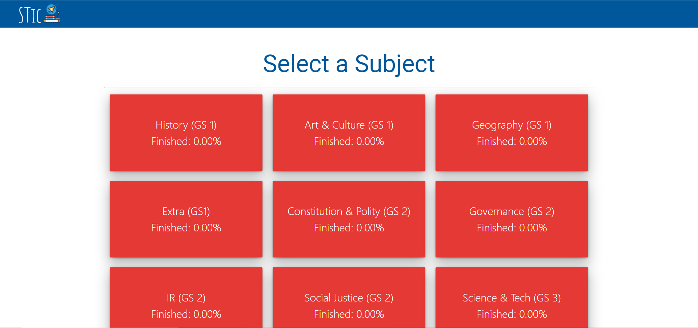
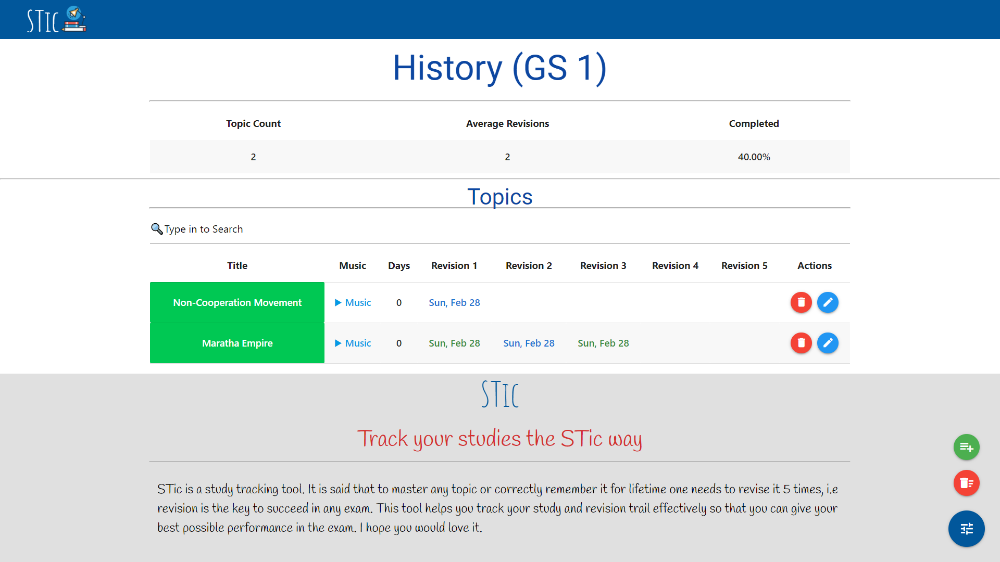

# STic
STic is a study tracking tool. It is said that to master any topic or correctly remember it for lifetime one needs to revise it 5 times, i.e revision is the key to succeed in any exam. This tool helps you track your study and revision trail effectively so that you can give your best possible performance in the exam. I hope you would love it.

Installation Guide:  
        1. Install [Node-JS](https://nodejs.org/en/download/) and [MongoDB](https://www.mongodb.com/try/download/community) 
        2. Clone the repository in your computer 
        3. Execute "install.bat" 
        4. Copy the shortcut ("STic.lnk") at your preferred location (Desktop) 
        5. excute the shortcut/run_server.bat 
        6. Manage your studies seamlessly

Home Snip
 
Subject Snip

